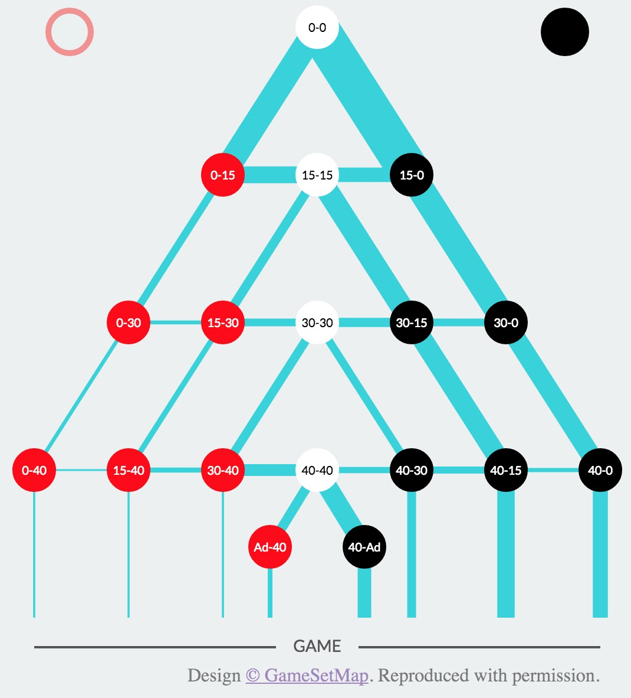

```{r setup, include=FALSE, warning=FALSE}
source("funs.R")
library(knitr)
opts_chunk$set(echo=FALSE)
options(kableExtra.latex.load_packages = FALSE) 
library(kableExtra)
library(tidyverse)
set.seed(400)
```

## Project 

- Based on a paper by Paul K. Newton and Joseph B. Keller called *Probability of Winning at Tennis 1. Theory and Data*

- Paper discussed how the probability of winning a game, a set, and a match in tennis are computed based on each player's probability of winning a point on a serve

- Based on other papers the conclusion was made to treat serves in tennis as independent identically distributed (iid) random variables

- It is noted that points in tennis are not iid for most purposes. This is not a bad assumption as the divergence from iid is small
  
- Both two out of three and three out of five set matches were considered allowing for 13-point tiebreaker in each set if needed
  
  
## The Rules of Tennis 

- Point: Smallest unit of measurement (Love-15-30-40-game)

- Game: A game is one when a player reaches 4 points with at least a 2 point advantage 

- Set: A set is won by the player who wins 6 games first

- Advantage Set: If a game score of 6-6 is reached and advantage set rules are used, a player can only win a set with a 2 game lead

- Matches: Best of 3 sets (for women) or 5 sets (for men)

- Tie-break game: If a game score of 6-6 is reached and tie-break set rules are used. In a tie-break game, a player/team must reach 7 points with a two point advantage to win

## The Rules of Tennis 

```{r,echo=FALSE, fig.align='center'}

```

## Values

Things we need to know:

- Empirical probability of winning a rally on serve 

- Empirical probability of winning a game on serve  \pause


Things we need to calculate: 

- Theoretical probability of winning a game on serve

- Theoretical probability of winning a set

- Theoretical probability of winning the tie-breaker 

- Theoretical probability of winning a match


## Theoretical Probabilities: Rally and Game


$$\text{P(A Winning a Rally | A Served)} = p_A^R = \frac{\text{Points Won On Serve}}{\text{Points Served}}$$ \pause


$$\text{P(A Winning a Game | A Served)}$$
$$=p_A^G = (p_A^R)^4[1+4q_A^R+10(q_A^R)^2] +20(p_A^Rq_A^R)^3(p_A^R)^2[1-2p_A^Rq_A^R]^{-1}$$ 

- Where Probability A loses a rally given A served: 
$$q_A^R = 1-\frac{\text{Points Won On Serve}}{\text{Points Served}}$$


## Theoretical Probabilities: Set


$$ \text{P(A Winnning a Set | A Served)} $$
$$= p_A^S =\sum_{j=0}^4p_A^S(6,j) + p_A^S(7,5) + p_A^S(6,6)p_A^T$$ \pause

Where, $p_A^S(i,j)$ is defined recursively as: 

$p_A^S(0,0) = 1$, $p_A^S(i,j) = 0$ if $i<0$ or $j<0$. 

- if i+j -1 is even: $p_A^S(i,j) = p_A^S(i-1,j)p_A^G + p_A^S(i, j-1)q_A^G$

    - omit i-1 term if j=6 and i<6

    - omit j-1 term if i=6 and j<6


- if i+j -1 is odd: $p_A^S(i,j) = p_A^S(i-1,j)q_B^G + p_A^S(i, j-1)p_B^G$

    - omit i-1 term if j=6 and i<6

    - omit j-1 term if i=6 and j<6


## Theoretical Probabilities: Tie Breaker


$$\text{P(A Winning the Tie Breaker | A Served Initially)} $$
$$=p_A^T = \sum_{j=0}^5p_A^T(7,j) +  p_A^T(6,6)p_A^Rq_B^R[1 - p_A^Rp_B^R - q_A^Rq_B^R]^{-1}$$ \pause

Where,  $p_A^T(i,j)$ is defined recursively as: 

$p_A^T(0,0) = 1$, $p_A^T(i,j) = 0$ if i<0 or j<0. 

- if $i+j -1 \mod 4 \equiv 0 \; \text{or} \;3$: $p_A^S(i,j) = p_A^T(i-1,j)p_A^R + p_A^T(i, j-1)q_A^R$

    - omit i-1 term if j=7 and i<7

    - omit j-1 term if i=7 and j<7


- if $i+j -1 \mod 4 \equiv 1 \; \text{or} \; 2$: $p_A^T(i,j) = p_A^T(i-1,j)q_B^R + p_A^T(i, j-1)p_B^R$

    - omit i-1 term if j=7 and i<7

    - omit j-1 term if i=7 and j<7


## Theoretical Probabilities: Match 

Women's (Best of 3):
$$\text{P(A Winning the Match | A Served First)}$$
$$=p_A^M = (p_A^S)^2 + 2(p_A^S)^2p_B^S$$ \pause


Men's (Best of 5):
$$\text{P(A Winning the Match | A Served First)}$$ 
$$=p_A^M = (p_A^S)^3 + 3(p_A^S)^3p_B^S + 6(p_A^S)^3(p_B^S)^2$$

Where: 

- $p_A^S=\text{Probabilty A wins a set given A served}$

- $p_B^S=\text{Probabilty B wins a set given B served}$

## Data
Data used in paper: 

  - Men and Women semifinalists in the 2002 U.S Open tournament 
  
  - Men and Women semifinalists in the 2002 Wimbledon tournament \pause
  
Data used in our simulation:
  
  - Men and Women semifinalists in the 2019 Wimbledon tournament
  

## Results of Game 
```{r, echo = FALSE}

TDWomen <- as.data.frame(matrix(0, nrow = 4, ncol = 3))

colnames(TDWomen) <- c("P(Win a Rally)", "Empirical P(Win a Game)", "Paper P(Win a Game)" )

TDWomen[1, ] <- c(0.69, 0.71, 0.89)
TDWomen[2, ] <- c(0.63, 0.80, 0.79)
TDWomen[3, ] <- c(0.65, 0.85, 0.83)
TDWomen[4, ] <- c(0.63, 0.77, 0.79)

OurDatWomen <- as.matrix(round(c(pg(TDWomen[1,1]), pg(TDWomen[2,1]), pg(TDWomen[3,1]), pg(TDWomen[4,1])),2))

TDWomen$`Our P(Win a Game)` <-(OurDatWomen)

rownames(TDWomen) <- c("S. Williams", "V. Williams", "L. Davenport", "A. Mauresmo")

kable(TDWomen, format = "latex", booktabs = TRUE, caption = "Data for the Womens Semifinalists in the 2002 U.S. Open Tournament
")%>%
          kable_styling(latex_options = "scale_down")

```
\pause
```{r, echo = FALSE}

TDMen<- as.data.frame(matrix(0, nrow = 4, ncol = 3))

colnames(TDMen) <- c("P(Win a Rally)", "Empirical P(Win a Game)", "Paper P(Win a Game)" )

TDMen[1, ] <- c(0.73, 0.95, 0.93)
TDMen[2, ] <- c(0.66, 0.87, 0.85)
TDMen[3, ] <- c(0.67, 0.85, 0.86)
TDMen[4, ] <- c(0.68, 0.90, 0.88)

OurDatWMen <- as.matrix(round(c(pg(TDMen[1,1]), pg(TDMen[2,1]), pg(TDMen[3,1]), pg(TDMen[4,1])),2))

TDMen$`Our P(Win a Game)` <-(OurDatWMen)

rownames(TDMen) <- c("P. Sampras", "A. Agassi", "L. Hewitt", "S. Schalken")

kable(TDMen, format = "latex", booktabs = TRUE, caption = "Data for the Mens Semifinalists in the 2002 U.S. Open Tournament
")%>%
          kable_styling(latex_options = "scale_down")

```

## 2002 U.S Open: Women
```{r, echo=FALSE, message=F, warning=F}
W02 <- read_csv('2002 US Open tournament- Women.csv') %>%
  filter(!is.na(Name)) %>%
  mutate(pRally = NA)

for(i in 1:4) {
  W02$pRally[i] <- pr(as.numeric(W02[i,2]), as.numeric(W02[i,3]))
}

pRally <- as.numeric(W02$pRally)

W02$pTC <- as.numeric(pTC(pRally[1], pRally[2], pRally[3], pRally[4], 2)) #c(.2872, .3599, .0482, .3074))
#`Our P(Winning the Tournement )` =round( pTC(TDWomen[1,1],TDWomen[2,1],TDWomen[3,1],TDWomen[4,1], 2), 4)

T1<- table(base::sample(W02$Name, 2000, prob = W02$pTC, replace = TRUE)) 


Winner1 <- which(T1 == max(T1))


ggplot(data.frame(T1)) +
  geom_col(aes(x=Var1, y=Freq/2000)) +
  xlab("Players") + 
  ylab("Number of Times Won") +
  ggtitle("Which Player Won the Tournament?",
          subtitle = "2002 Women's US Open")

```

## 2002 U.S Open: Women

\centerline{\includegraphics[height=2in]{Serena.png}}


## 2002 U.S Open: Men
```{r, echo=FALSE, message=FALSE, warning=FALSE}
mOpen <- read_csv('2002 US Open- Men.csv') %>%
  filter(!is.na(Name)) %>%
  mutate(pRally = NA)

for(i in 1:4) {
  mOpen$pRally[i] <- pr(as.numeric(mOpen[i,2]), as.numeric(mOpen[i,3]))
}

pRally <- as.numeric(mOpen$pRally)

mOpen$pTC <- as.numeric(pTC(pRally[1], pRally[2], pRally[3], pRally[4], 3))
#`Our P(Winning the Tournement )` =round( pTC(TDMen[1,1],TDMen[2,1],TDMen[3,1],TDMen[4,1], 2), 4)

T2<- table(base::sample(mOpen$Name, 2000, prob = mOpen$pTC, replace = TRUE)) 


Winner2 <- which(T2 == max(T2))


ggplot(data.frame(T2)) +
  geom_col(aes(x=Var1, y=Freq/2000)) +
  xlab("Players") +
  ylab("Proportion of Times Won") +
  ggtitle("Which Player Won the Tournament?",
          subtitle = "2002 Men's US Open")

```

## 2002 U.S Open: Men


\centerline{\includegraphics[height=2in]{Pete.png}}


## 2002 Wimbledon: Women

```{r, message=F, warning=F}
wWim02 <- read_csv('2002 Wimbledon -Women.csv') %>%
  filter(!is.na(Name)) %>%
  mutate(pRally = NA)

for(i in 1:4) {
  wWim02$pRally[i] <- pr(as.numeric(wWim02[i,2]), as.numeric(wWim02[i,3]))
}

pRally <- as.numeric(wWim02$pRally)

wWim02$pTC <- as.numeric(pTC(pRally[1], pRally[2], pRally[3], pRally[4], 2))

T3 <- table(base::sample(wWim02$Name, 2000, prob = wWim02$pTC, replace = TRUE))

ggplot(data.frame(T3)) +
  geom_col(aes(x=Var1, y=Freq/2000)) +
  xlab('Players') +
  ylab('Proportion of Times Won') +
  ggtitle('Which Player Won the Tournament?',
          subtitle = "2002 Women's Wimbledon")
```

## 2002 Wimbledon: Women

\centerline{\includegraphics[height=2in]{Serena2.png}}


## 2002 Wimbledon: Men

```{r, message=F, warning=F}
mWim02 <- read_csv('2002 Wimbledon- Men.csv') %>%
  filter(!is.na(Name)) %>%
  mutate(pRally = NA)

for(i in 1:4) {
  mWim02$pRally[i] <- pr(as.numeric(mWim02[i,2]), as.numeric(mWim02[i,3]))
}

pRally <- as.numeric(mWim02$pRally)

mWim02$pTC <- as.numeric(pTC(pRally[1], pRally[2], pRally[3], pRally[4], 3))

T4 <- table(base::sample(mWim02$Name, 2000, prob = mWim02$pTC, replace = TRUE))

ggplot(data.frame(T4)) +
  geom_col(aes(x=Var1, y=Freq/2000)) +
  xlab('Players') +
  ylab('Proportion of Times Won') +
  ggtitle('Which Player Won the Tournament?',
          subtitle = "2002 Men's Wimbledon")
```

## 2002 Wimbledon: Men

\centerline{\includegraphics[height=2in]{Hewitt.png}}

## 2019 Wimbledon: Women 

```{r, warning=FALSE, echo=FALSE, message=F}

wWim19 <- read_csv('2019 Womens Wimbledon.csv') %>%
  filter(!is.na(Name)) %>%
  mutate(pRally = NA)

for(i in 1:4) {
  wWim19$pRally[i] <- pr(as.numeric(wWim19[i,2]), as.numeric(wWim19[i,3]))
}

pRally <- as.numeric(wWim19$pRally)

wWim19$pTC <- as.numeric(pTC(pRally[1], pRally[2], pRally[3], pRally[4], 2))

T4 <- table(base::sample(wWim19$Name, 2000, prob = wWim19$pTC, replace = TRUE))

ggplot(data.frame(T4)) +
  geom_col(aes(x=Var1, y=Freq/2000)) +
  xlab('Players') +
  ylab('Proportion of Times Won') +
  ggtitle('Which Player Won the Tournament?',
          subtitle = "2019 Women's Wimbledon")
```


## 2019 Wimbledon: Women 

\centerline{\includegraphics[height=2in]{Simona.png}}


## 2019 Wimbledon: Men 

```{r, warning=FALSE, echo=FALSE, message=F}

mWim19 <- read_csv("2019 Men's Wimbledon.csv") %>%
  filter(!is.na(Name)) %>%
  mutate(pRally = NA)

for(i in 1:4) {
  mWim19$pRally[i] <- pr(as.numeric(mWim19[i,2]), as.numeric(mWim19[i,3]))
}

pRally <- as.numeric(mWim19$pRally)

mWim19$pTC <- as.numeric(pTC(pRally[1], pRally[2], pRally[3], pRally[4], 3))

T5 <- table(base::sample(mWim19$Name, 2000, prob = mWim19$pTC, replace = TRUE))

ggplot(data.frame(T5)) +
  geom_col(aes(x=Var1, y=Freq/2000)) +
  xlab('Players') +
  ylab('Proportion of Times Won') +
  ggtitle('Which Player Won the Tournament?',
          subtitle = "2002 Men's Wimbledon")
```

## 2019 Wimbledon: Men 

\centerline{\includegraphics[height=2in]{Novak.png}}

